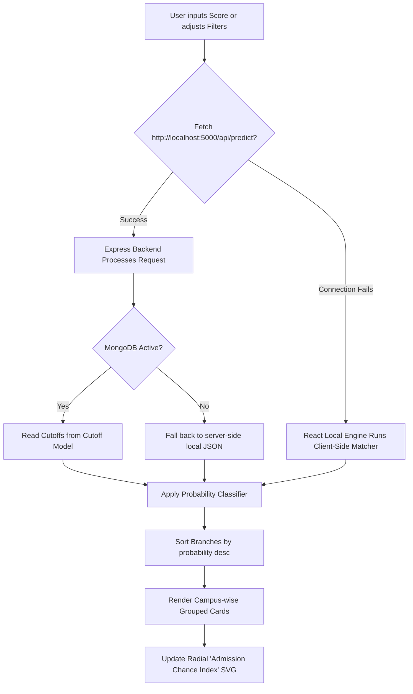

# BITSAT College & Branch Predictor: Pitch & Flow Documentation

This document pitches the design strategy, value proposition, and under-the-hood engine architecture of the **BITSAT College & Branch Predictor**.

---

## The Pitch: Why This Predictor Wows Users

Traditional college predictors are clunky, rely on static tables, and fail if their backend databases are temporarily unavailable. 

Our **BITSAT College Predictor** is engineered as a modern, premium **MERN Stack Dashboard** that solves these limitations:
1. **Dynamic Glassmorphic Interface**: Dark aesthetics featuring smooth sliders, radial index gauges, and neon color-coded chance badges that update instantly as the user types.
2. **Reliable Dual-Engine Flow (Offline Resiliency)**: If the backend MongoDB is unreachable, the frontend seamlessly runs the *exact same* mathematical prediction algorithm client-side, showing a `Local Engine (Offline Mode)` badge instead of breaking.
3. **Multi-Year Trend Analysis**: Displays cutoffs side-by-side (2022, 2023, 2024) to give applicants context on how competition has grown.
4. **Probability-Based Status Badges**: Uses an adaptive cutoff matching algorithm to show real chances rather than a simplistic "Yes/No":
   - 🟢 **Very High (95%+ chance)**: Score is $\ge \text{Cutoff} + 15$
   - 🔵 **High (75% - 95% chance)**: Score is between $\text{Cutoff}$ and $\text{Cutoff} + 15$
   - 🟡 **Medium (40% - 75% chance)**: Score is between $\text{Cutoff} - 10$ and $\text{Cutoff}$
   - 🔴 **Low (10% - 40% chance)**: Score is between $\text{Cutoff} - 25$ and $\text{Cutoff} - 10$
   - ⚫ **Unavailable**: Score is below $\text{Cutoff} - 25$

---

## Architectural Flow & Logic

The system flows through a deterministic cycle from input to rendering:

### The Classifier Formula (JavaScript Implementation)
To estimate the probability dynamically, the matcher compares the input score  to the latest (2024) cutoff :

This ensures that even if a student is slightly below the cutoff, they see a realistic "Medium" or "Low" chance rather than an outright rejection, mirroring real-world counseling iterations.
